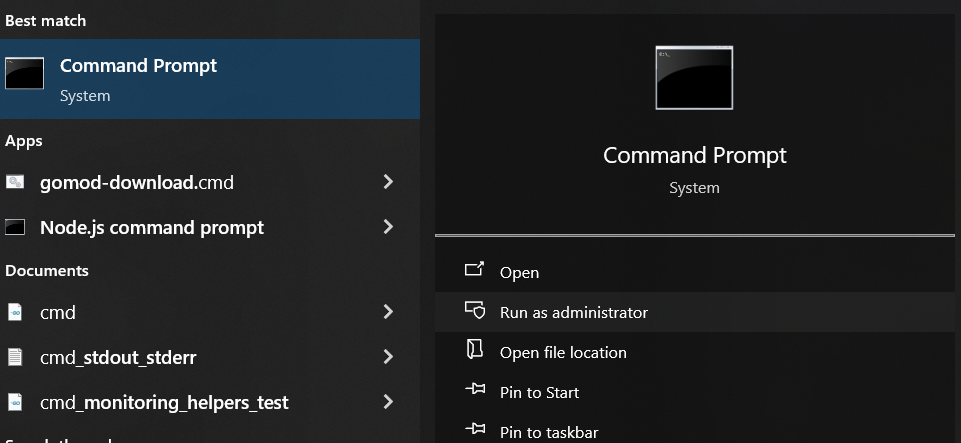
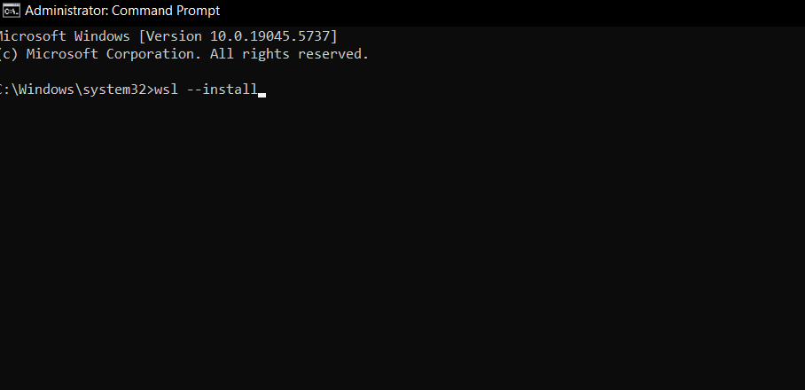
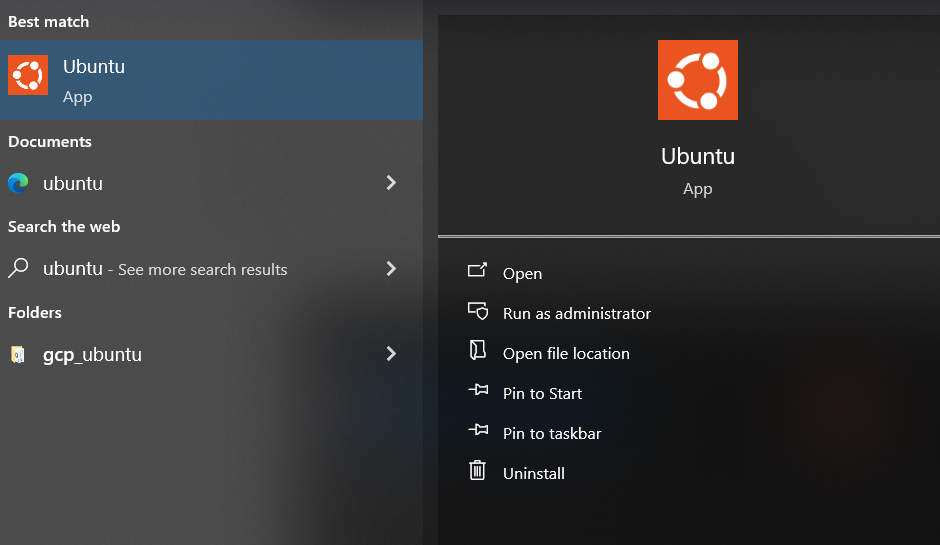
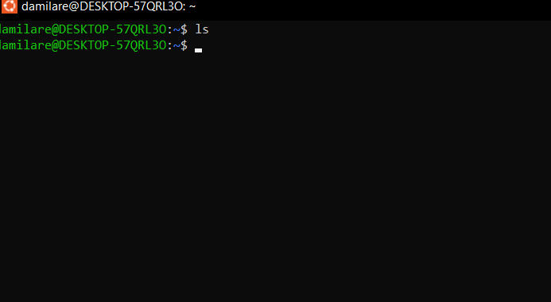
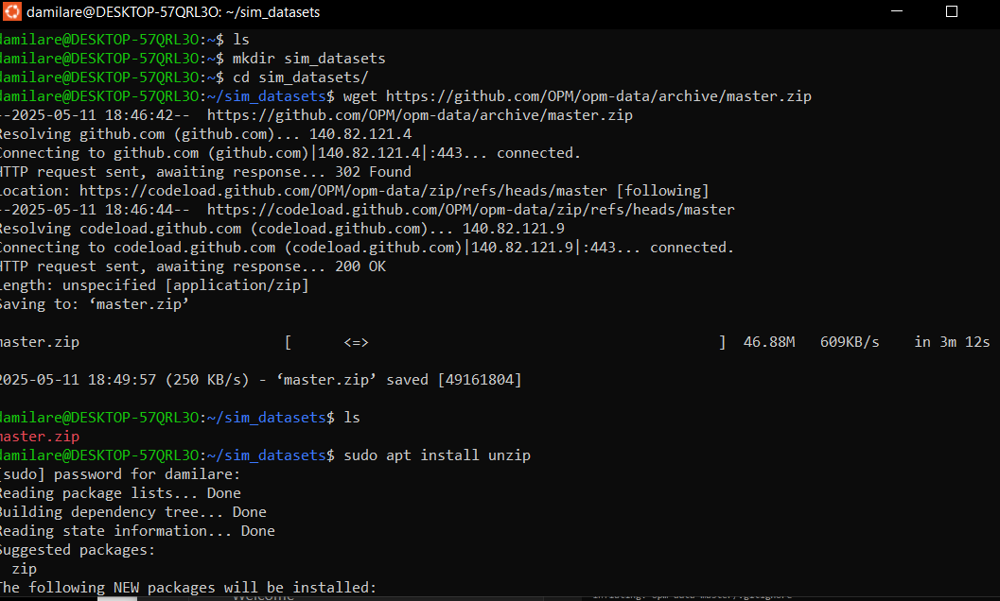
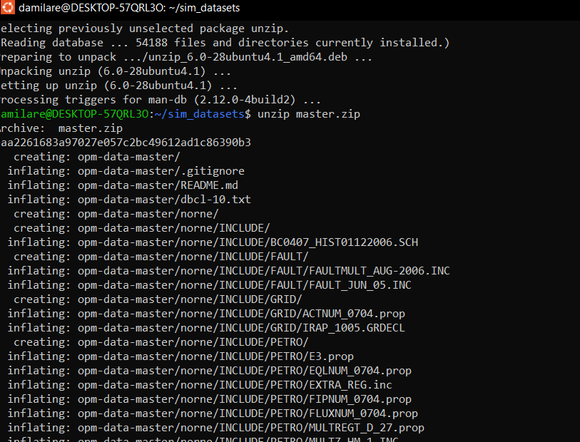
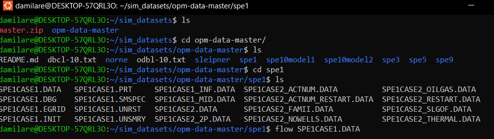
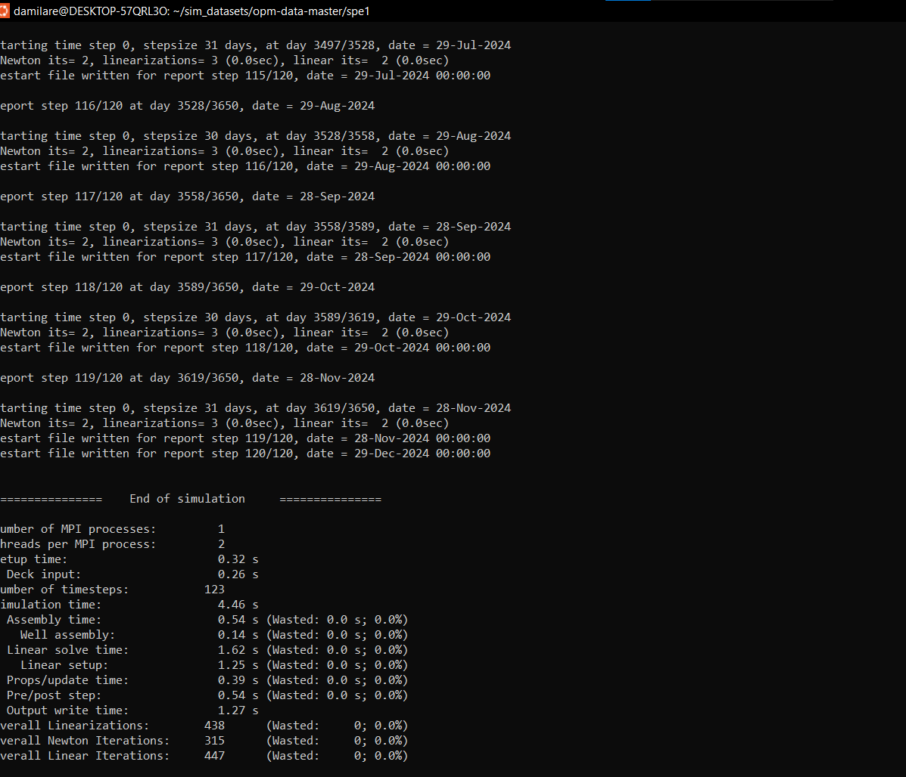
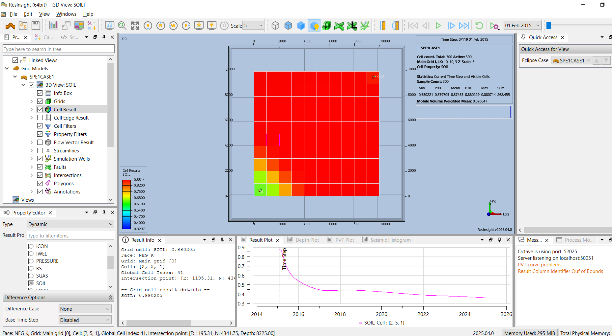

# OPM-flow-WSL-guide
## Installing and Running OPM on Windows using WSL2 
The [Open Porous Media (OPM) initiative](https://opm-project.org/) provides tools for open and reproducible simulation and modelling of porous media processes. OPM targets the Linux platform, and this can make it tricky to set up on other platforms such as Windows. The current documentation outlines ways to get around this and experiment with OPM on other platforms, but I have found the Windows Subsystem for Linux (WSL) to be the easiest way to run flow and other Linux applications on Windows as opposed to Docker for Windows or a virtual machine.
WSL provides a Linux environment directly on Windows that can be easily accessed from the start menu or command-line, without the overhead of setting up a virtual machine or partitioning your hard drive and dual-booting Linux and Windows.  
Before you get started make sure Virtualization is enabled in your BIOS and that you are running Windows 10 version 2004 and higher (Build 19041 and higher) or Windows 11.
After that setting it up is as easy as typing `wsl --install` as an administrator in PowerShell or the Windows Command Prompt by selecting "Run as administrator"
as show in the image below.

*Figure 1. Running Command Prompt as an administrator*

*Figure 2. Installing WSL*
For more information consult the official installation guide [here](https://learn.microsoft.com/en-us/windows/wsl/install)
Once the installation is complete, you will be prompted for a username and password for the newly installed Linux distribution (WSL installs Ubuntu by default).
Now you can launch Ubuntu from the start menu like this:

*Figure 3. Open Ubuntu from the start menu*
After setting it up you can install and run flow like you would on any other Linux machine shown in the documentation. Install OPM from binary packages by following the instructions: https://opm-project.org/?page_id=245 [guide](https://opm-project.org/?page_id=245) .
You may have noticed the Linux environment is empty except for a few hidden config files and folders:

*Figure 4. Empty WSL Ubuntu command-line environment*
Let's change that by downloading the [OPM datasets](https://github.com/OPM/opm-data) from GitHub.

*Figure 5. Creating a folder to store OPM datasets and run simulations*

*Figure 6. Unzipping the dataset archive*
You can then run any of the simulations shown in the tutorials as demonstrated with the SPE1 dataset in the image below:

*Figure 7. Demonstration of flow with the spe1 dataset*
If the simulation is successful, you should see something like this:

*Figure 8. PRT summary of the previous simulation*
Finally, you can open ReInsight and visualize the model as shown:

*Figure 9. Visualizing the model with ReInsight*